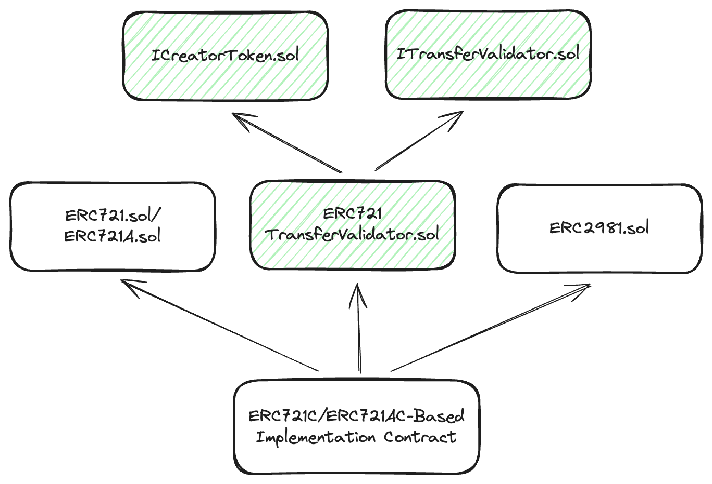
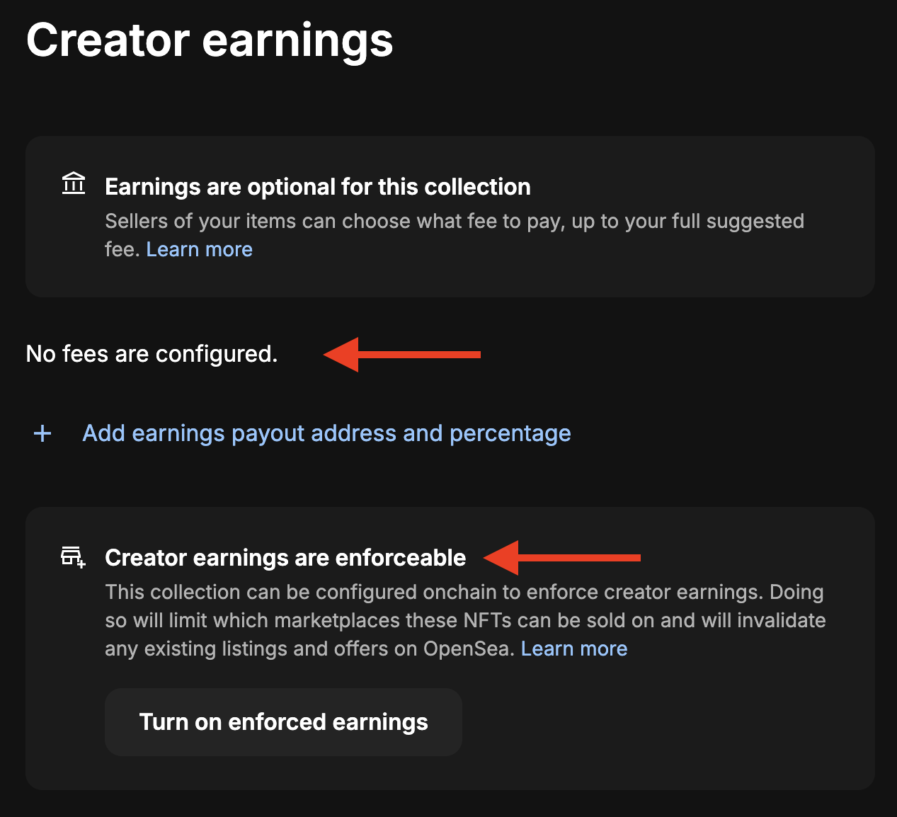
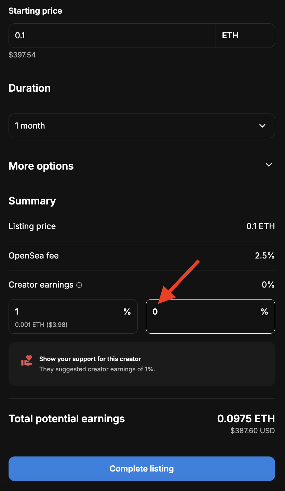
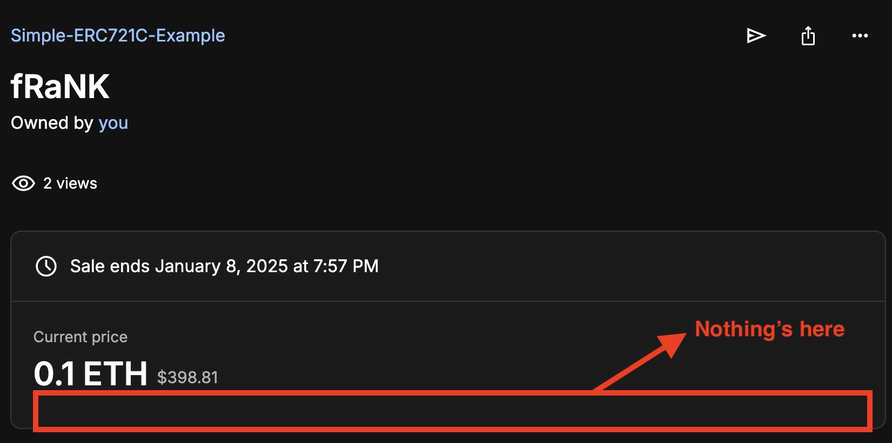
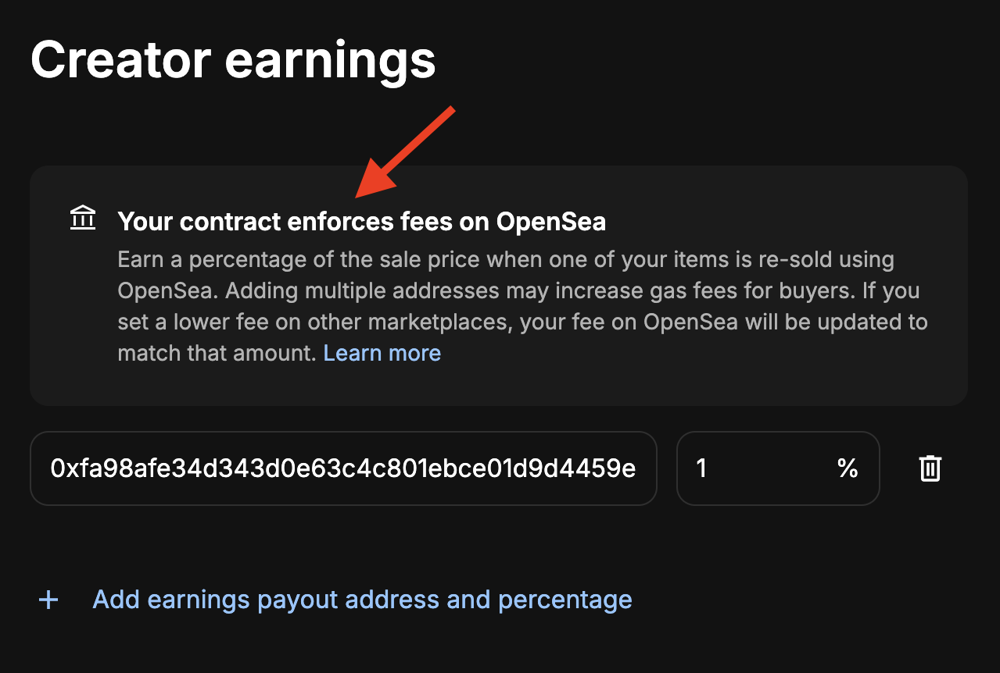
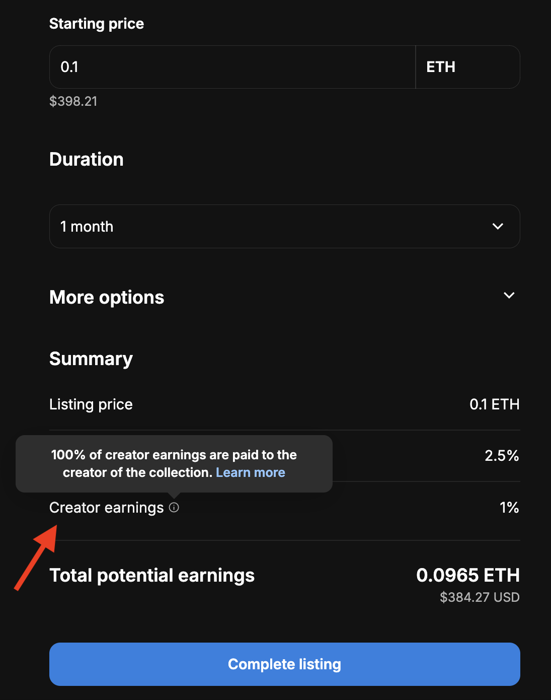
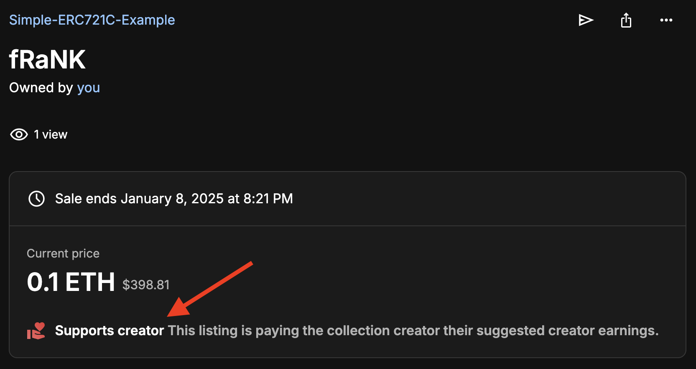

# Simple ERC721 Creator Fee Enforcement Extension

## Background
In April 2024, OpenSea announced that creators can now use [ERC721-C](https://github.com/limitbreakinc/creator-token-contracts/tree/main) from [Limit Break](https://limitbreak.com/index.html) to set and enforce their own creator earnings on OpenSea ([link](https://opensea.io/blog/articles/creator-earnings-erc721-c-compatibility-on-opensea)).

The article stated that its also applicable for the creator who's using ERC721-C or ERC1155-C compatible custom smart contract. I've found [examples](https://github.com/limitbreakinc/creator-token-contracts/tree/main/contracts/examples) from LimitBreak's github repo to serve that purpose but it doesn't suit my needs. So, I decided to make a simple extension based on [OpenSea's Creator Fee Enforcement docs](https://docs.opensea.io/docs/creator-fee-enforcement) without having to inherit to LimitBreak's ERC721-C.

## About
This repository is about a simple contract extension to be inherited by any ERC721-based implementation contract to comply with OpenSea's creator fee enforcement. There are two examples of its implementation:
1. [ERC721C](https://github.com/0xkuwabatake/simple-ERC721C-extension/blob/main/src/examples/ERC721C.sol) is for ERC721-based contract.
2. [ERC721AC](https://github.com/0xkuwabatake/simple-ERC721C-extension/blob/main/src/examples/ERC721AC.sol) is for ERC721A-based contract.

## Implementations

1. Implementation contract MUST inherit to `ERC721TransferValidator.sol` ([link](https://github.com/0xkuwabatake/simple-ERC721C-extension/blob/main/src/extensions/ERC721TransferValidator.sol)). The inherited contract itself implements interfaces from `ICreatorToken.sol` ([link](https://github.com/0xkuwabatake/simple-ERC721C-extension/blob/main/src/interfaces/ICreatorToken.sol)) and `ITransferValidator721.sol` ([link](https://github.com/0xkuwabatake/simple-ERC721C-extension/blob/main/src/interfaces/ITransferValidator721.sol)).
2. Implementation contract MUST implement `setTransferValidator`([link](https://github.com/0xkuwabatake/simple-ERC721C-extension/blob/main/src/examples/ERC721C.sol#L55)) external function as [its defined at](https://github.com/0xkuwabatake/simple-ERC721C-extension/blob/main/src/interfaces/ICreatorToken.sol#L26) `ICreatorToken.sol` with an access control (in this case, only contract's owner can invoke the function).
3. In this case, implementation contract inherits to ERC2981 ([NFT Royalty Standard](https://eips.ethereum.org/EIPS/eip-2981)) contract [by Solady](https://github.com/Vectorized/solady/blob/main/src/tokens/ERC2981.sol).
4. Override `supportsInterface` [function](https://github.com/0xkuwabatake/simple-ERC721C-extension/blob/main/src/examples/ERC721C.sol#L64) to also returns `true` for `0xad0d7f6c` as ICreatorToken's interface ID and `0x2a55205a` as ERC2981's interface ID.
4. Override `_beforeTokenTransfer` hook ([ERC721C](https://github.com/0xkuwabatake/simple-ERC721C-extension/blob/main/src/examples/ERC721C.sol#L100) / [ERC721AC](https://github.com/0xkuwabatake/simple-ERC721C-extension/blob/main/src/examples/ERC721AC.sol#L95)) to facilitate `validateTransfer` as [its defined at](https://github.com/0xkuwabatake/simple-ERC721C-extension/blob/main/src/interfaces/ITransferValidator721.sol#L13) `ITransferValidator.sol` before token is transferred from and to non-zero address.
5. There are two ways to set transfer validator contract:
    - At contract deployment by defining `_setTransferValidator` ([link](https://github.com/0xkuwabatake/simple-ERC721C-extension/blob/main/src/extensions/ERC721TransferValidator.sol#L64)) and `_setDefaultRoyalty` ([link](https://github.com/Vectorized/solady/blob/main/src/tokens/ERC2981.sol#L99)) values [inside the constructor](https://github.com/0xkuwabatake/simple-ERC721C-extension/blob/main/src/examples/ERC721AC.sol#L30) OR
    - After contract deployment (runtime) by:
        - Call `setTransferValidator` external function OR
        - Hit `Turn on enforced earnings` at OpenSea collection page's settings (see examples below) to invoke a transaction to call `setTransferValidator` function  and automatically sets the `validator` contract to `CreatorTokenTransferValidator.sol` by Limit Break ([link](https://github.com/limitbreakinc/creator-token-contracts/blob/main/contracts/utils/CreatorTokenTransferValidator.sol)).

## Deployed Contracts at Base Sepolia Testnet

| Contract | Address                                                                                                                       | OpenSea(testnets)
|----------|-------------------------------------------------------------------------------------------------------------------------------|-------------------------------------------------------------------------------------------|
| ERC721C  | [0x1FeB3f98e42Ccb79DDb9462d2f041d0DAded4c05](https://sepolia.basescan.org/address/0x1feb3f98e42ccb79ddb9462d2f041d0daded4c05) | [Simple-ERC721C-Example](https://testnets.opensea.io/collection/simple-erc721c-example)   |
| ERC721AC | [0x68Db515f9FC5173E78153E6449C8420De07bEE02](https://sepolia.basescan.org/address/0x68db515f9fc5173e78153e6449c8420de07bee02) | [Simple-ERC721AC-Example](https://testnets.opensea.io/collection/simple-erc721ac-example) |

## Example of Implementations

These examples are based on deployed ERC721C and its OpenSea's collection page at testnets (above).

1. This is what we MUST see at `Creator earnings` tab at OpenSea's collection page settings when transfer validator contract is not set - meaning `getTransferValidator` ([link](https://github.com/0xkuwabatake/simple-ERC721C-extension/blob/main/src/extensions/ERC721TransferValidator.sol#L38)) returns zero address, but since our custom contract is comply we always have an option to enforce it.

2. After fees were configured via OpenSea without setting transfer validator contract.

3. The owner of a NFT has an option to not paying creator fee (creator fee sets to 0%), when transfer validator contract is not set.

4. Listed NFT when transfer validator contract is not set.

5. Transaction hash when listed NFT (#4) is bought:
[https://sepolia.basescan.org/tx/0x37ee9e0b79e79da2b60a542cabff589f757e8cccb1daf57e305afa5f5f966b5e](https://sepolia.basescan.org/tx/0x37ee9e0b79e79da2b60a542cabff589f757e8cccb1daf57e305afa5f5f966b5e)

6. This is what we see at `Creator earnings` tab when transfer validator contract is set ([transaction's log](https://sepolia.basescan.org/tx/0xc6c49bf3694974fd82e35c5a69434f9fdd09078086aae8973ae925aaacdcbf42#eventlog)).

7. The owner of a NFT has NO option to not paying creator fee (creator fee is enforced), when transfer validator contract has been set.

8. Listed NFT when transfer validator contract is set.

9. Transaction hash when listed NFT (#7) is bought:
[https://sepolia.basescan.org/tx/0xa1aceeb4d754c681090d4534d76b8280aeac0f6d27a236ac05f29bdf88ef6c54](https://sepolia.basescan.org/tx/0xa1aceeb4d754c681090d4534d76b8280aeac0f6d27a236ac05f29bdf88ef6c54)

## Important Notes
It's just example contracts that demonstrates how to implement creator fee enforcement for ERC721-based contracts, so do NOT blindly copy anything here into production code unless you really know what you are doing. Test thoroughly before implements it to your custom contract.